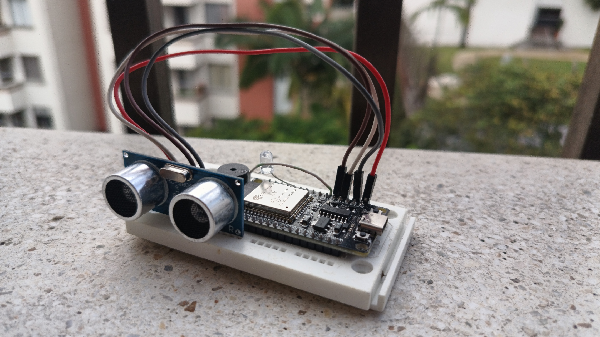

---
# Portafolio Personal — Alejandro Díaz Osorio ⚡

Bienvenido a mi portafolio personal, desarrollado con [Astro](https://astro.build/).
Aquí comparto mis proyectos más destacados, habilidades técnicas y formas de contacto profesional.
---

## 🖼️ Vista previa

---

## 🚀 Tecnologías y herramientas

- [Astro](https://astro.build/)
- HTML5, CSS3, JavaScript (ES6+)
- Vite (incluido con Astro)
- Node.js & npm

---

## 📦 Instalación y ejecución local

Sigue estos pasos para ejecutar el proyecto en tu entorno local:

1. Clona el repositorio
   `git clone https://github.com/alejandro-diaz-osorio/portfolio.git`

2. Entra al directorio del proyecto
   `cd portfolio`

3. Instala las dependencias
   `npm install`

4. Inicia el servidor de desarrollo
   `npm run dev`

El sitio estará disponible en `http://localhost:4321` (o el puerto que indique la consola).

---

## 📁 Estructura del proyecto

- `src/` – Código fuente del sitio
- `public/` – Archivos estáticos (imágenes, íconos, etc.)
- `astro.config.mjs` – Configuración del proyecto Astro
- `package.json` – Dependencias y scripts del proyecto

---

## 👤 Autor

**Alejandro Díaz Osorio**
📧 \[[osoriodiazalejandro@gmail.com](mailto:osoriodiazalejandro@gmail.com)]
🔗 [LinkedIn](https://www.linkedin.com/in/alejandro-diaz-osorio) • [X](https://x.com/AlejoLives)

---

